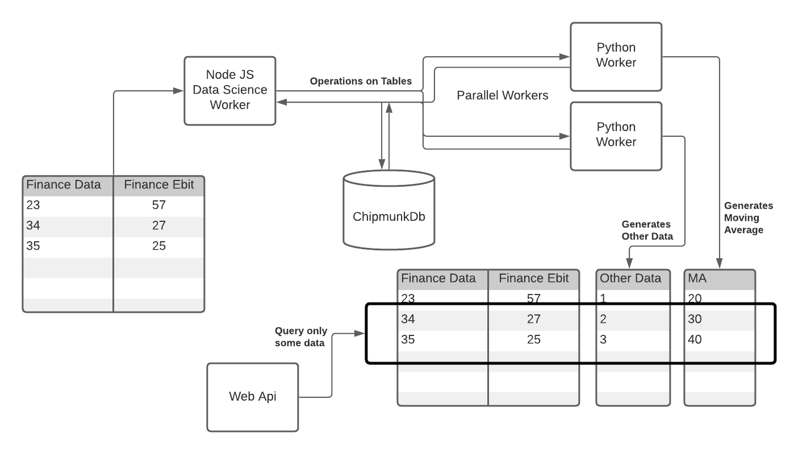

# chipmunkdb :chipmunk:
### It´s like a super fast network-pandas with a query-engine


### Why we´ve built this

- :chipmunk: IPC between different Proceses with lightning fast data exchange
    - Saving of 45MB of Data in 379ms :rocket:
    - Loading of 45MB of Data in 80ms :rocket:
    - Querying only a part of the data in about to 14ms     
- No need to copy data from one process to another (with pyarrow help)
- Time-Series-Database support very fast
- Reading a whole Table in complete
- Querying on a completely saved Table (Timeseries, Columns or other data)
- Adding, Removing Column
- Rest Api 
- Docker Container for direct-usage
- No-Schema needed
- Saving complete table or adding single rows 

# Example Use Cases

## Time-Series Data
Save a complete Time-Series-Data in a ChipmunkDB-Table and query only the needed data. Update all the Time-Series Data with pandas very fast and save it back.


## Quickstart
```docker
docker run -p 8091:8091 --name chipmunkdb coindeck/chipmunkdb

# 8086 = rest api port
# 5441 = raw data file

```

## Develop Installation
```python
# how to run it 
pip install -r requirements.txt

python src/index.py

```

#### Create Docker 
```docker
# how to build docker


```


## Usage Description



## Examples


